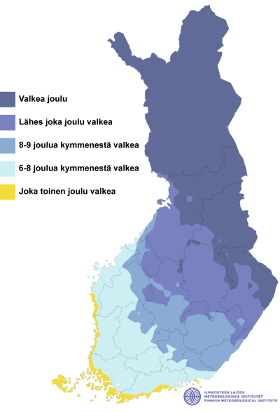

[](https://classroom.github.com/a/tWyQ2Yyn)
# Final Assignment

### Status

Once you are finished with the final assignment, edit this readme and add "x" to the correct box:

* [ ] Submitted

* [x] I'm still working on my final assignment. 


*If you have done this assignment in pair, write your groupmate's name here:* ----

The final deadline for submission is **6.1.2026**.


### Instructions

*you can remove these instructions for the final submission*

Read the final assignment instructions from the course webpages [https://autogis-site.readthedocs.io](https://autogis-site.readthedocs.io/en/latest/final-assignment/final-assignment.html). Remember to write readable code, and to provide adequate documentation using inline comments and markdown. Organize all your code(s) / notebook(s) into this repository and **add links to all relevant files to this `README.md`file**. In sum, anyone who downloads this repository should be able to **read your code and documentation** and understand what is going on, and **run your code** in order to reproduce the same results! :) 

**Modify this readme so that anyone reading it gets a quick overview of your final work topic, and finds all the necessary input data, code and results.** 

*Note: If your code requires some python packages not found in the csc notebooks environment, please mention them also in this readme and provide installation instrutions.*

*Note: Don't upload large files into GitHub! If you are using large input files, provide downloading instructions and perhaps a small sample of the data in this repository for demonstrating your workflow.*

Fill in details of your final project below. You can remove this instructions-section from the README-file if you want.

## Topic: 

This projects attemps to analyze the likelihood of a "White Christmas" in Finland. It uses FMI's snow depth data to answer the following questions:
- How likely is it to observe a "White Christmas" across Finland?
- Has that likelihood changed since there is data available?

The first question is heavily inspired by the following FMI map[^1]:



In this FMI map there are 5 different categories describing the likelihood of a White Christmas (24.-26.12) across Finland, from only 1 in 2 christmas being white all the way to always white.

The `final-assignment.ipynb` notebook exemplifies how one can leverage the `snow.py` module from this repo to achieve a similar analysis. Several raster classification and custom plot functions are made available for this effect. Using them, one can go further with this kind of analysis to make comparisons of the likelihood of a "White Christmas" occurring in Finland over different time periods, shining light on the second proposed question.

### Structure of this repository:

```
/final-assignment-marcelomouta
├── final-assignment.ipnyb  # Notebook exemplifying the usage of snow.py
├── snow.py                 # Python module for loading and analyzing FMI snow depth rasters
├── snow_utils.py           # Helper functions for snow.py
├── /data
    └── /regions            # Shapefile with Finland's regions
    └── /snow               # Sample of FMI snow depth rasters used with snow.py
├── /img                    # Images used in documentation
└── README.md               # Project documentation
```

### Input data:

The main dataset[^2] used in this project can be dowloaded from Paituli [here](https://paituli.csc.fi/download.html?data_id=il_daily_snow_10km_geotiff_euref). It contains daily snow depth by FMI for the period 1961-2024 with a 10km x 10km resolution.

A sample of the data has been provided in the repository to exemplify the usage, under `data/snow`. The example notebook contains workarounds to run most of the examples using only sample data, but the full data is recommended for fully exploring the capabilities of `snow.py`.

Aditionally, vector data with the regions of Finland by The National Land Survey of Finland (MML)[^3] is used to enrich our maps visualisation. The shapefile is also provided in this repo, under `data/regions`.

### Analysis steps:

### Results:

### Feedback
-

### References:

[^1]: The Probability of White Christmas is retrieved from the following [FMI Christmas weather statistics (in Finnish)](https://www.ilmatieteenlaitos.fi/joulunaika).  
A similar analysis in English can be found [here](https://en.ilmatieteenlaitos.fi/christmas-weather), although with more outdated data. 

[^2]: The dataset is part of FMI Climgrid and it is licensed under a Creative Commons Attribution 4.0 International License. The dataset's metadata is available at [Etsin](https://etsin.fairdata.fi/dataset/c63d696a-8d42-44aa-8508-9024ee05cfa7).

[^3]: Retrieved from [opendata.fi](https://www.opendata.fi/data/en_GB/dataset/suomen-maakunnat-2021-vuoden-2018-maakuntakoodeilla). The regions shapefile is provided by [MML](https://www.maanmittauslaitos.fi/en/maps-and-spatial-data) and it is licensed under a Creative Commons Attribution 4.0 International License.