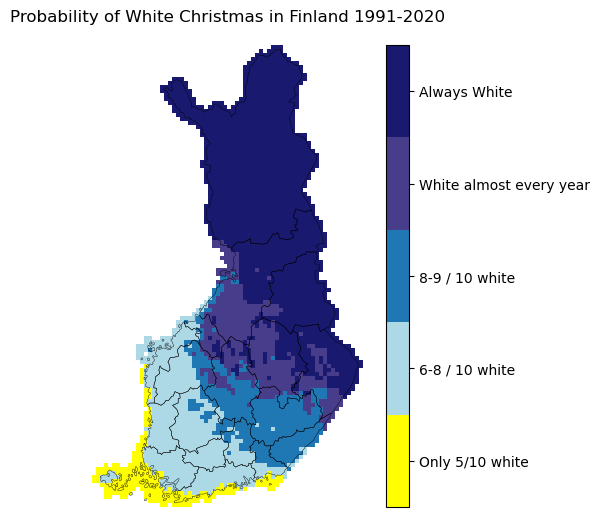
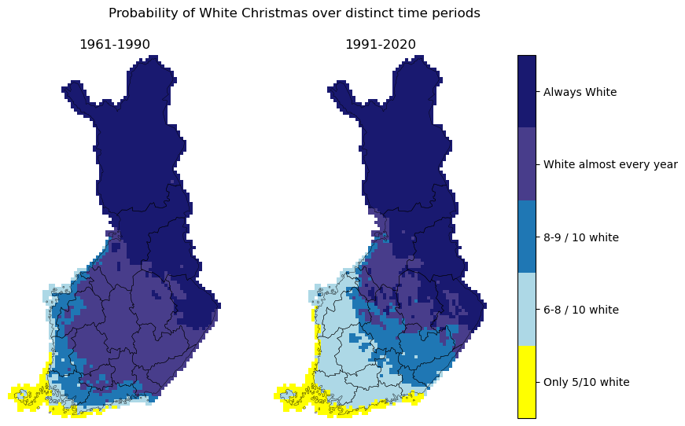

# White Christmas in Finland

## Web tool for visualisation
There is a web app for non-programming inclined people to be able to see the results as well:

[](https://whitexmas.streamlit.app)

## Topic:

This projects attemps to analyze the likelihood of a "White Christmas" in Finland. It uses Finnish Meteorological Institute (FMI) snow depth data to answer the following questions:
- How likely is it to observe a "White Christmas" across Finland?
- Has that likelihood changed since there is data available?

The first question is heavily inspired by the following FMI map[^1]:


In this FMI map there are 5 different categories describing the likelihood of a White Christmas (24.-26.12) across Finland, from only 1 in 2 christmas being white all the way to always white.

The `final-assignment.ipynb` notebook exemplifies how one can leverage the `snow.py` module from this repo to achieve a similar analysis. Several raster classification and custom plot functions are made available for this effect. Using them, one can go further with this kind of analysis to make comparisons of the likelihood of a "White Christmas" occurring in Finland over different time periods, shining light on the second proposed question.

### Structure of this repository:

```
/final-assignment-marcelomouta
├── final-assignment.ipnyb  # Notebook exemplifying the usage of snow.py
├── snow.py                 # Python module for loading and analyzing FMI snow depth rasters
├── snow_utils.py           # Helper functions for snow.py
├── /data
    └── /regions            # Shapefile with Finland's regions
    └── /snow               # Sample of FMI snow depth rasters used with snow.py
├── /img                    # Images used in documentation
└── README.md               # Project documentation
```

### Input data:

The main dataset[^2] used in this project can be dowloaded from Paituli [here](https://paituli.csc.fi/download.html?data_id=il_daily_snow_10km_geotiff_euref). It contains daily snow depth by FMI for the period 1961-2024 with a 10km x 10km resolution.

A sample of the data has been provided in the repository to exemplify the usage, under `data/snow`. The example notebook contains workarounds to run most of the examples using only sample data, but the full data is recommended for fully exploring the capabilities of `snow.py`.

Aditionally, vector data with the regions of Finland by The National Land Survey of Finland (MML)[^3] is used to enrich our maps visualisation. The shapefile is also provided in this repo, under `data/regions`.

### Analysis steps:

The steps for the analysis are explained briefly below, but can be understood in more detail in the provided notebook.

After loading the FMI snow cover data (and optionally MML border shapefiles), one can use `snow.py` to:
 - Convert FMI yearly snow rasters into average snow during Christmas days (24.-26.12)
 - Classify each year's average Christmas snow into a a white or non-white Christmas if the average passes a given threshold
 - Using last steps analysis, classify the likelihood of white christmas over a given period into 5 distinct probability classes
 - Go further with the analysis by comparing distinct time period results with each other.

### Results:

After performing the previously described analysis, the following map was produced for the period 1991-2020:



The probability classes have a good overlap with the map provided by FMI, even though it is not known which criteria was used to consider a christmas as white in that case.

From this point, the following map was obtained by adding together the previous 1991-2020 analysis with that of 1961-1990:



The side-by-side maps show a clear change in the likelihood of a white Christmas in Finland, in particular in the soutwest regions of the country. This analysis and resulting maps give us good answers on the questions asked at the beggining of this document.


The provided notebook has step-by-step instructions on how to produce both of these 2 maps, among others.


### References:

[^1]: The Probability of White Christmas is retrieved from the following [FMI Christmas weather statistics (in Finnish)](https://www.ilmatieteenlaitos.fi/joulunaika).  
A similar analysis in English can be found [here](https://en.ilmatieteenlaitos.fi/christmas-weather), although with more outdated data. 

[^2]: The dataset is part of FMI Climgrid and it is licensed under a Creative Commons Attribution 4.0 International License. The dataset's metadata is available at [Etsin](https://etsin.fairdata.fi/dataset/c63d696a-8d42-44aa-8508-9024ee05cfa7).

[^3]: Retrieved from [opendata.fi](https://www.opendata.fi/data/en_GB/dataset/suomen-maakunnat-2021-vuoden-2018-maakuntakoodeilla). The regions shapefile is provided by [MML](https://www.maanmittauslaitos.fi/en/maps-and-spatial-data) and it is licensed under a Creative Commons Attribution 4.0 International License.
